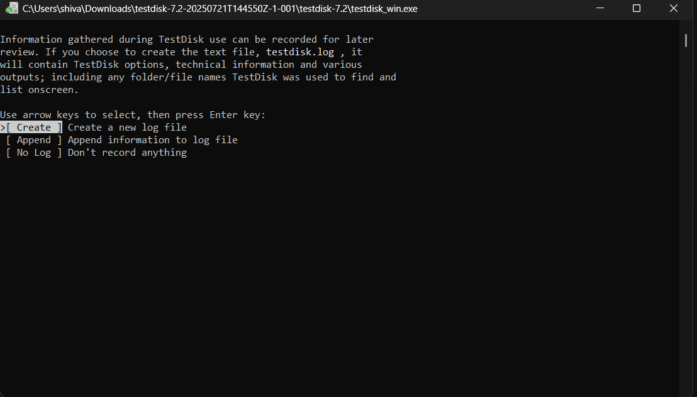
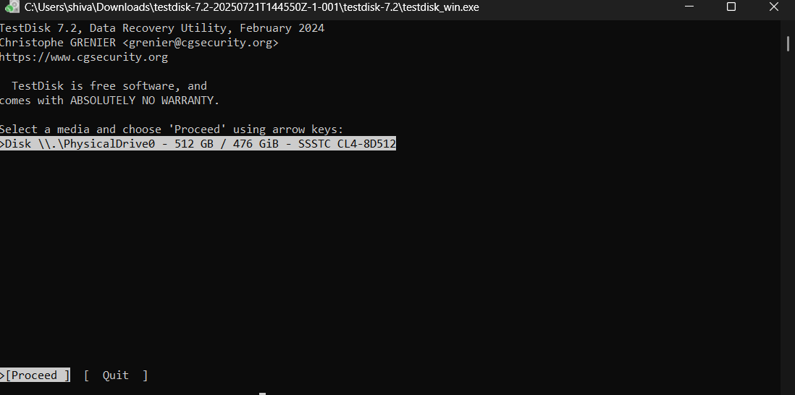
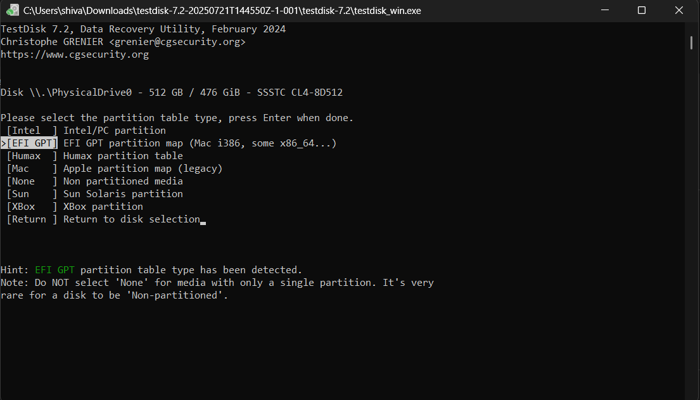
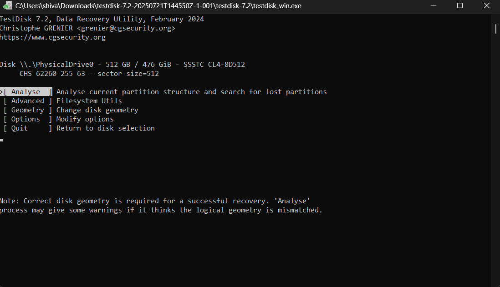
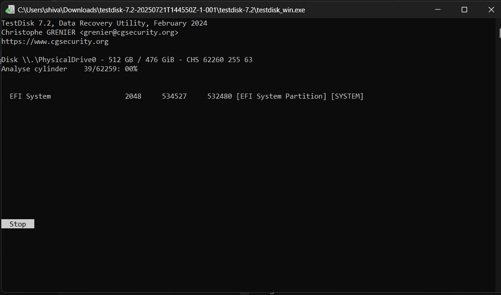
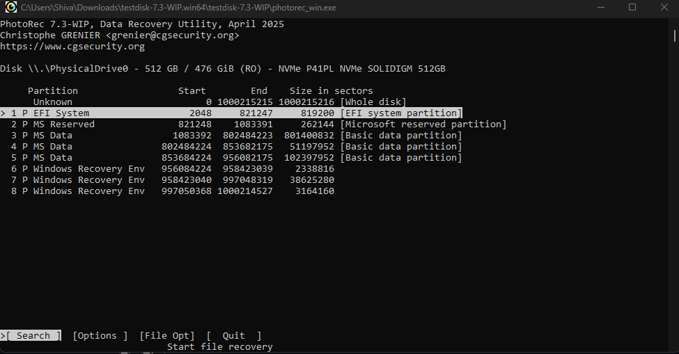
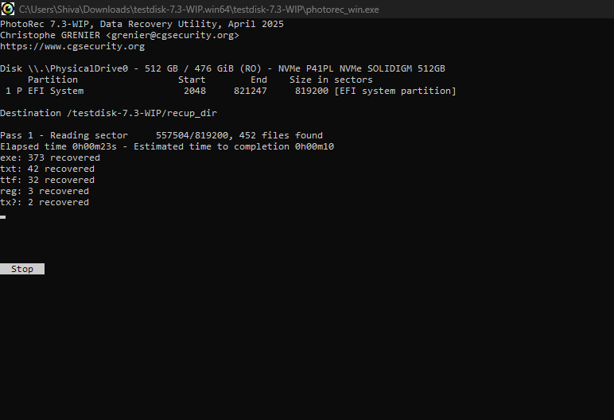
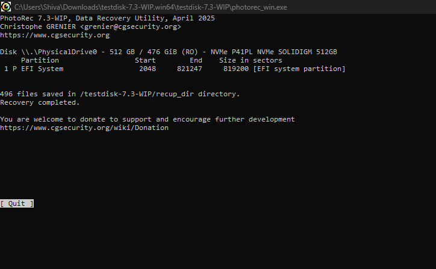

# Experiment 2: Recover Deleted or Damaged Files using TestDisk

## 🎯 Aim
Recover deleted or damaged files and partitions from a storage device using **TestDisk**.

---

## 📝 Description
TestDisk is an open-source data recovery software designed to recover lost partitions and repair non-booting disks. It can:

- Fix partition tables
- Recover deleted partitions
- Repair corrupted boot sectors
- List and copy files from deleted partitions

---

## ⚙️ Procedure

### Step 1: Start TestDisk
- Run `testdisk_win.exe`
- Select **Create** to create a new log file.

### Step 2: Select Disk
- All hard drives should be detected and listed with correct sizes.
- Use arrow keys to select the drive with the missing/damaged partition.
- Prefer **/dev/rdisk** (raw device) for faster transfer (if available).

### Step 3: Select Partition Table
- TestDisk will auto-detect the partition table.
- Usually the default is correct → press **Enter**.

### Step 4: Analyse Partitions
- Select **Analyse** → press Enter.
- Current partition structure will be displayed.
- Check for errors or missing partitions.

### Step 5: Quick Search
- Select **Quick Search** to find lost partitions.
- Found partitions will be listed in real-time.
- Highlight a partition → press **p** to list files.
- Red entries = deleted files.

### Step 6: Mark and Recover Partitions
- Highlight the correct partition.
- Change status from **D (Deleted)** → **L (Logical)** or **P (Primary)**.
- Press Enter to confirm.

### Step 7: Write Partition Table
- Choose **Write** → press Enter → confirm with **Y**.
- Partition table will be saved.

### Step 8: Repair Boot Sector (if needed)
- If NTFS boot sector is damaged:
  - Select **Backup BS** to restore from backup.
  - Confirm → now Boot Sector and Backup are identical.

### Step 9: Restart
- Exit TestDisk.
- Restart system to access recovered partitions/files.

---

## 📷 Screenshots

