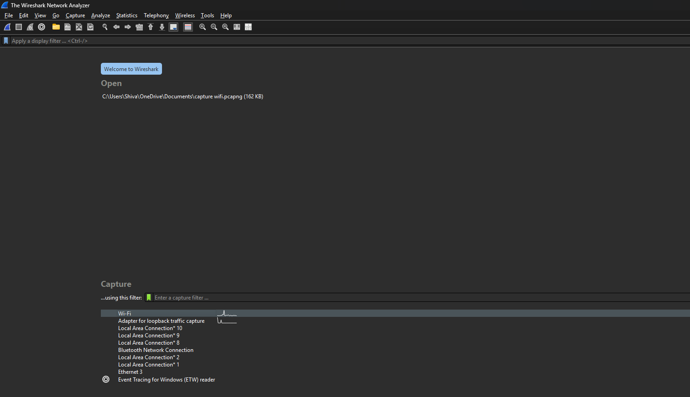
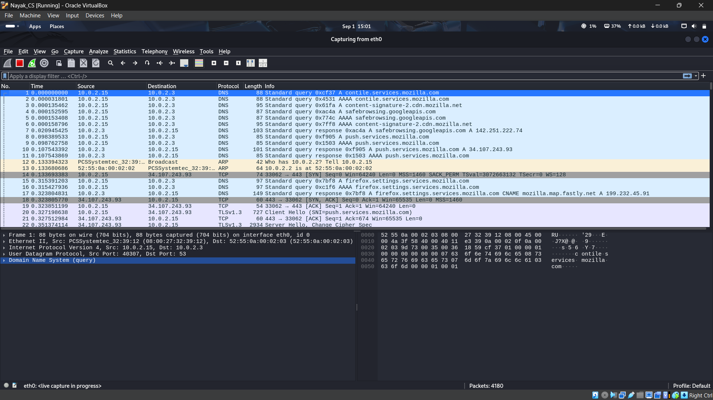
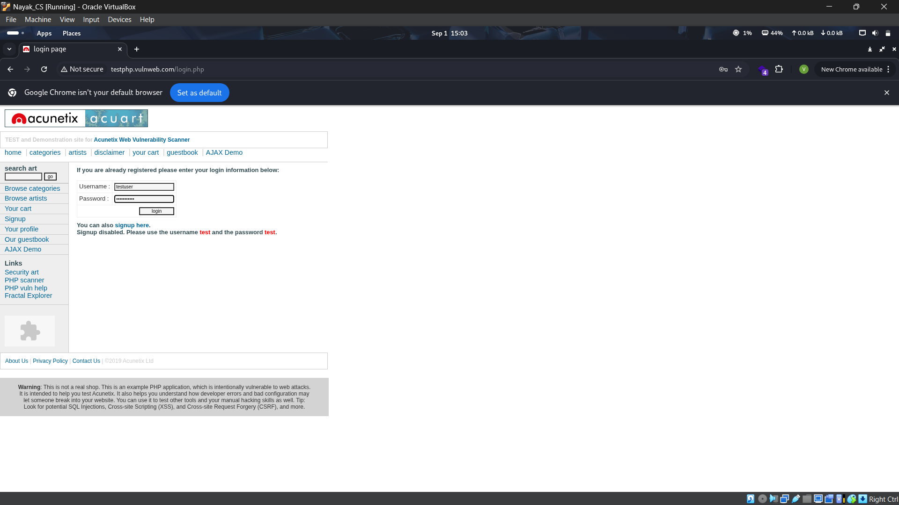
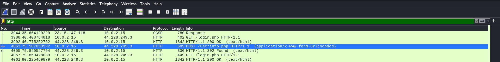
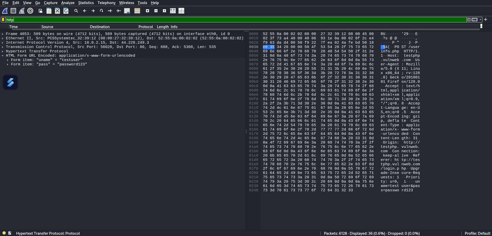

# Experiment 3: Password Capturing using Wireshark

##  Aim
To capture and analyze network traffic using **Wireshark** and extract login credentials transmitted over insecure protocols (HTTP).

---

##  Description
Wireshark is a powerful network protocol analyzer that can capture and inspect data packets in real time.  
If a protocol transmits data in plaintext (like HTTP, FTP, Telnet), Wireshark can sniff sensitive information such as:

- Usernames
- Passwords
- Email addresses
- Form submissions

This experiment demonstrates how to capture login credentials using HTTP requests.

---

##  Procedure

### Step 1: Start Wireshark
- Open **Wireshark** on Windows or Linux VM.
- Select the active network interface (e.g., Wi-Fi) and click **Start Capturing**.

### Step 2: Generate Login Traffic
- Visit a test website with an **HTTP login form** (not HTTPS).
- Enter credentials (e.g., username + password) and submit.

### Step 3: Apply HTTP Filter
- In the Wireshark display filter bar, type:
- This will show all captured HTTP packets.

### Step 4: Check GET Requests
- Apply the filter:
- Inspect packets → usually login form data is **not** submitted using GET.

### Step 5: Check POST Requests
- Apply the filter:
- Look for packets containing **form data**.
- Expand the packet details:
- Go to **HTML Form URL Encoded** section.
- Extract the credentials.

### Example:

---

## 📷 Screenshots / Evidence

